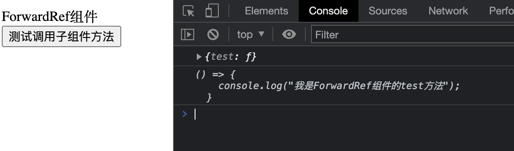

### React.forwardRef Review

#### Scenario: When I need to do the autofocus of the multiple textInput. I need to pass the ref to my own function components. And the error told me that I should use forwardRef to pass the ref to the function components.

#### We know that the class components can accept ref, but function components can not.

```typescript
import { useImperativeHandle, forwardRef } from 'react';

const Test = forwardRef((props, ref) => {
  console.log('ref in Test: ', ref);

  useImperativeHandle(ref, () => ({
    test
  }));

  const test = () => {
    console.log('我是ForwardRef组件的test方法');
  };

  return <div>{'ForwardRef组件'}</div>;
});
export default Test;
```



#### The result is shown below:

#### When we want to pass ref to HOC(Higher Order Components), we should wrap its parent components with forwardRef.And it will works.
#### Conclusion:<br/>
1. when ref is referenced in HTML DOM, the element will store in { current: DOM }
2. when ref is referenced by class components, ref will accept mounted instantiation in { current: instantiation }
3. ref can not be referenced in a function component, due function component does not have instantiation